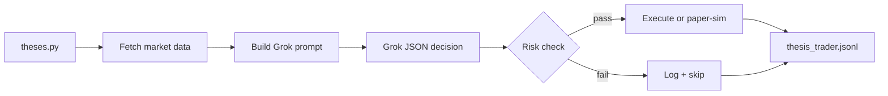

# Thesis Grok Trader

A minimal, private, thesis-driven trading runner powered by [Grok (xAI)](https://docs.x.ai/).

You define **2–5 clear strategies** in one file (`theses.py`). Each run fetches market data for that thesis's watchlist, asks Grok for a single JSON decision, runs strict risk checks, and either paper-simulates or routes an order through IBKR. No research host, no Postgres, no signal engine, no ReAct agent loop — just a linear pipeline you can read in one sitting.

**Paper trading is the default everywhere.**

---

## Risk warning

**Trading involves substantial risk of loss.** This software is for education and paper practice.

- Default: `EXECUTION_BACKEND=local_sim` (simulated fills, no broker)
- Live trading requires **both** `TRADING_MODE=live` **and** `EXECUTION_BACKEND=ibkr`
- Never trade with money you cannot afford to lose
- Simulated results do not guarantee future performance

---

## Features

- **Thesis-first** — each strategy is a self-contained narrative + watchlist in `theses.py`
- **Linear flow** — `main.py` is the single source of truth for how a trade happens
- **Grok decisions** — one JSON response per thesis cycle (`buy` / `sell` / `hold`)
- **Strict risk gates** — cash-only sizing, min reward:risk, daily loss / drawdown caps
- **Transparent logging** — every step appended to `logs/thesis_trader.jsonl`
- **Reused execution stack** — IBKR, MarketData.app, and xAI SDK wired from a proven codebase

---

## Quick start

```bash
git clone <your-repo-url>
cd thesis
python -m venv .venv

# Windows
.venv\Scripts\activate
# macOS / Linux
source .venv/bin/activate

pip install -r requirements.txt
copy .env.template .env   # or: cp .env.template .env
```

Edit `.env` — minimum required:

| Variable | Purpose |
|----------|---------|
| `GROK_API_KEY` or `XAI_API_KEY` | Grok API access |
| `MARKETDATA_TOKEN` | Real-time quotes (strongly recommended) |

Define strategies in `theses.py` (see commented template), then:

```bash
python main.py --list              # show enabled theses
python main.py                     # run all enabled theses (max 5)
python main.py --thesis my_id      # run one thesis by id
```

---

## How a trade happens



| Step | Module | What happens |
|------|--------|--------------|
| 1 | `theses.py` | Load 1–5 enabled theses |
| 2 | `glue/fetch_data.py` | Quote, candles, ATR, etc. for watchlist |
| 3 | `glue/prompt_builder.py` | Thesis narrative + data + account snapshot |
| 4 | `core/grok_llm.py` | Grok returns `{ action, symbol, quantity, ... }` |
| 5 | `glue/risk_check.py` | Watchlist, sizing, R:R, safety rails |
| 6 | `glue/paper_broker.py` or `execution/` | Simulated fill (default) or IBKR order |
| 7 | `glue/trade_logger.py` | Full audit trail |

Read `main.py` first — every step is commented inline.

---

## Execution modes

| Setting | Behavior |
|---------|----------|
| `EXECUTION_BACKEND=local_sim` | **Default.** Simulated cash account. No TWS needed. |
| `EXECUTION_BACKEND=ibkr` | Routes orders to TWS / IB Gateway (paper port 7497 by default). |

| `TRADING_MODE` | Risk profile |
|----------------|--------------|
| `paper` | **Default.** 1% risk/trade, 2:1 min R:R |
| `aggressive_paper` | Higher risk for stress-testing |
| `live` | Real money — requires explicit IBKR live setup |

---

## Project layout

```
thesis/
├── main.py              # Start here — full linear trading flow
├── theses.py            # Your strategies (main file to edit)
├── glue/                # Paper broker, prompts, risk, logging
├── core/                # Grok SDK + risk configuration
├── data/                # MarketData.app client + DataProvider
├── execution/           # IBKR order routing
├── tools/               # Extended tool handlers (optional)
├── memory/              # No-op stubs (no database)
└── logs/                # JSONL audit log (gitignored)
```

---

## Adding a thesis

Open `theses.py` and add a `Thesis(...)` entry:

```python
Thesis(
    id="momentum_large_cap",
    name="Large-cap momentum",
    description=(
        "Look for names holding above the 20-day range with rising volume. "
        "Only enter when reward:risk is at least 2:1. Hold when trend is unclear."
    ),
    watchlist=["AAPL", "MSFT", "NVDA"],
    enabled=True,
    data_fields=["quote", "candles", "atr"],
),
```

Grok may **only** pick symbols from `watchlist`. Keep 2–5 theses enabled at once.

---

## Configuration reference

Key `.env` variables (see `.env.template` for the full list):

```env
EXECUTION_BACKEND=local_sim
PAPER_STARTING_CASH=100000
TRADING_MODE=paper
CASH_ONLY=true
RISK_PER_TRADE=1.0
MIN_RR=2.0
MAX_DAILY_LOSS_PCT=15.0
```

---

## Requirements

- Python 3.11+
- Grok API key ([xAI console](https://console.x.ai/))
- MarketData.app token (recommended)
- TWS or IB Gateway (only if `EXECUTION_BACKEND=ibkr`)

---

## License

Private project — all rights reserved unless you add a license file.
